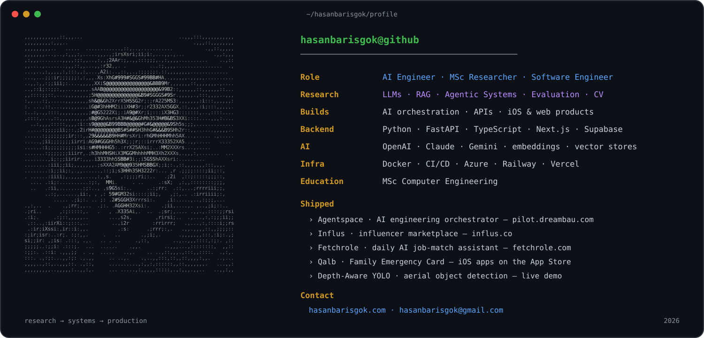
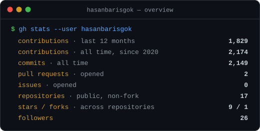
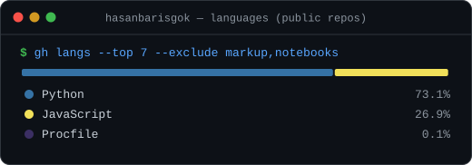
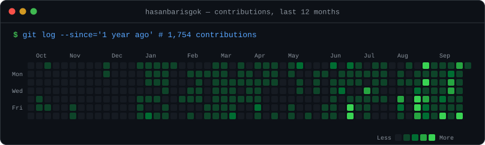

# Hasan Barış Gök

**AI Engineer · MSc Researcher (Computer Engineering) · Software Engineer**

 

## About

I build **AI systems that survive contact with production** — LLM applications, retrieval-grounded (RAG) pipelines, multi-agent orchestration, and the evaluation tooling that tells you whether any of it actually works. I own the full loop: **system design → model integration → evaluation → deployment → operations**.

- 🎓 MSc researcher in **Computer Engineering** at **Çukurova University** — LLM context reliability, RAG evaluation, computer vision
- 🚀 Shipped **two iOS apps** on the App Store, **two web products** (Influs live, Fetchrole in early access), and an internal **agentic engineering platform**
- 🧱 Comfortable across the stack: **Python / FastAPI**, **TypeScript / Next.js**, **Supabase / PostgreSQL**, **SwiftUI**, **Docker & CI/CD**
- 🧑‍🤝‍🧑 Founded and led a **Google Developer Student Clubs** chapter — organised **23 technical events**
- 🌍 Based in Türkiye, working with international and remote teams

 

## Featured Work

<table>
<tr>
<td width="50%" valign="top">

### 🤖 Agentspace — AI Engineering Orchestrator
**Repository-aware agentic delivery platform**

Turns a ticket into shipped code with humans in the loop: ticket enrichment → execution planning → automated implementation → review → deployment, with live logs, ownership checks and approval gates at every step.

`Claude Code CLI` `Python` `Async orchestration` `GitHub API` `CI/CD`

<a href="https://pilot.dreambau.com/">pilot.dreambau.com ↗</a>

</td>
<td width="50%" valign="top">

### 🛰️ Depth-Aware YOLO — Aerial Object Detection
**Oriented detection + pseudo-depth**

YOLO OBB detector for `airplane` · `bird` · `drone` · `helicopter` with Depth Anything pseudo-depth visualisation, served by a Dockerised FastAPI inference API on Railway.

**Validation:** `0.987 mAP50` · `0.976 precision` · `0.972 recall`

`YOLO OBB` `Depth Anything` `FastAPI` `Docker` `Railway`

<a href="https://github.com/hasanbarisgok/Depth-Aware-YOLO-Based-Aerial-Object-Detection">Repository ↗</a> · <a href="https://hasanbarisgok.com/aod4-demo">Live demo ↗</a>

</td>
</tr>
<tr>
<td width="50%" valign="top">

### 🩻 COVID-19 & Pneumonia Detection from Chest X-Rays
**End-to-end medical AI pipeline** · 

Custom CNN trained in MATLAB, exported to ONNX for portability and served through a FastAPI + ONNX Runtime API — three-class CXR classification (COVID-19 / Normal / Pneumonia). Research-only proof of concept, published on Zenodo.

`MATLAB` `ONNX Runtime` `FastAPI` `Docker`

<a href="https://github.com/hasanbarisgok/covid19api">Repository ↗</a>

</td>
<td width="50%" valign="top">

### 🧪 ParaContext — LLM Context Adherence Benchmark
**Hallucination vs. grounded-answer evaluation**

Async evaluation framework comparing context-splitting against full-context prompting; measures context adherence and position bias across models with custom metrics. MSc Information Retrieval research project.

`Python` `LLM APIs` `Async evaluation` `Custom metrics`

*Research direction: RAG evaluation, context reliability, evidence-grounded generation.*

</td>
</tr>
<tr>
<td width="50%" valign="top">

### 🛡️ Turkish Toxic Comment Filter
**From scratch-built dataset to a working Chrome extension**

Scraped and labelled ~5,000 Turkish comments on polarising topics, trained a toxicity / hate-speech classifier, and shipped it as a Chrome extension that flags toxic comments and hides hate speech on Ekşi Sözlük in real time.

`Python` `NLP` `Machine Learning` `JavaScript` `Chrome Extension`

<a href="https://github.com/hasanbarisgok/Turkish-Toxic-Comment-Filter-Chrome-Plugin">Repository ↗</a>

</td>
<td width="50%" valign="top">

### 📱 Qalb — Islamic Dua & Prayer
**Production RAG mobile app on the App Store**

Retrieval-grounded dua & prayer companion: vector retrieval over a curated corpus, embeddings + LLM APIs, FastAPI backend, native iOS client. Localised in four languages.

`SwiftUI` `FastAPI` `Supabase (pgvector)` `LLM APIs` `RAG`

<a href="https://apps.apple.com/app/id6759472577">App Store ↗</a>

</td>
</tr>
</table>

 

## Shipped Products & Platforms

| Product | What it is | Stack | Link |
|---|---|---|---|
| **Influs** | Türkiye's influencer marketplace — listings, applications, contracts, content approval, dispute handling and escrow-style payouts on top of the **iyzico marketplace** API. | Next.js · Supabase (RLS/RPC) · iyzico · Sentry · Playwright · Docker/VDS CI/CD | [influs.co ↗](https://influs.co) |
| **Fetchrole** *(early access)* | Daily AI job-match & application assistant — scans the last 24 h of postings, matches them against your CV, and drafts tailored CVs and cover letters. Pool-first, multi-provider LLM fallback to keep costs low. | Next.js · LLM APIs · Scheduled pipelines | [fetchrole.com ↗](https://fetchrole.com) |
| **Family Emergency Card: ICE ID** | iOS app for family emergency health profiles — fast-access emergency card, PDF export, home-screen widget. | SwiftUI · Home-screen widget · PDF export | [App Store ↗](https://apps.apple.com/app/id6758922379) |
| **Qalb** | See *Featured Work* above. | SwiftUI · FastAPI · RAG | [App Store ↗](https://apps.apple.com/app/id6759472577) |
| **Monss** | Website and contact API for Monss, a Calgary-based digital product design agency. | Next.js · Serverless API · Vercel | [monss.co ↗](https://monss.co) |

Plus a number of client websites, landing pages and small APIs delivered on Next.js / Vercel.

 

## Research & Academic Projects

| Project | Context | Notes |
|---|---|---|
| **COVID-19 & Pneumonia CXR Detection** | Published on Zenodo · [DOI 10.5281/zenodo.18139089](https://doi.org/10.5281/zenodo.18139089) | MATLAB → ONNX → FastAPI; reproducible research artefact |
| **Depth-Aware YOLO Aerial Detection** | Computer Vision (CENG0038), Çukurova University — MSc | 0.987 mAP50 on a 4-class oriented-box dataset; live demo |
| **ParaContext** | Information Retrieval — MSc | LLM context adherence & position-bias benchmark |
| **Text-based feature selection** | MSc research — ongoing | Feature selection strategies for text representations |
| **Turkish Toxic Comment Filter** | NLP (BMB434), Osmaniye Korkut Ata University | Self-built 5k-comment dataset, classifier, Chrome extension |
| **Distributed Tic-Tac-Toe** | Distributed Processing, Politechnika Gdańska | Socket/thread-based multiplayer game server & client — team lead ([repo](https://github.com/hasanbarisgok/PG_DistrubutedProcessing_XOX)) |
| **Military Expenditure Dashboard** | Data visualisation | Interactive geopolitical data visualisation |

 

## Open Source & Tools

| Repository | Description |
|---|---|
| [**SahibindenAnalysis**](https://github.com/hasanbarisgok/SahibindenAnalysis) ⭐ 6 | Selenium scraper + cleaning pipeline + multi-page Streamlit app with Folium maps for vehicle-listing price analysis across Turkey |
| [**DataScience**](https://github.com/hasanbarisgok/DataScience) | NumPy / Pandas / Seaborn notebooks, SQL notes and mini analysis projects on open data |
| [**OutlookAutomation**](https://github.com/hasanbarisgok/OutlookAutomation) | Streamlit + Selenium bulk-email automation for Outlook |
| [**heic_to_jpg**](https://github.com/hasanbarisgok/heic_to_jpg) | Batch HEIC → JPG converter (Streamlit, pillow-heif) |
| [**st_batch_image_resizer**](https://github.com/hasanbarisgok/st_batch_image_resizer) | Batch image resizer with a Streamlit UI |
| [**YouTube-Video-Downloader-and-Converter**](https://github.com/hasanbarisgok/YouTube-Video-Downloader-and-Converter) | MP4 / MP3 downloader built on PyTube + MoviePy |

 

## Tech Stack

**AI & Research**

`LLMs` · `RAG / Agentic RAG` · `Multi-Agent Systems` · `Embeddings & Vector Stores` · `Evaluation & Benchmarking` · `NLP` · `Computer Vision (YOLO / OBB)` · `ONNX`

**Backend & Product**

`REST APIs` · `Async Python` · `SwiftUI` · `Supabase RLS / RPC` · `Payments (iyzico, StoreKit 2)` · `i18n`

**Infrastructure & Tooling**

`CI/CD` · `Railway` · `Sentry` · `Playwright` · `GitHub API` · `Jira`

 

## GitHub Activity

  

Cards are generated daily by <a href="./.github/workflows/stats.yml">a GitHub Actions workflow in this repo</a> — no third-party image services.

 

## Contact

Open to **AI systems work, research collaborations, and interesting engineering problems.**

[hasanbarisgok.com](https://hasanbarisgok.com/) · [LinkedIn](https://www.linkedin.com/in/hasanbarisgok) · [X](https://x.com/hasanbarisgok) · [hasanbarisgok@gmail.com](mailto:hasanbarisgok@gmail.com)

research → systems → production

